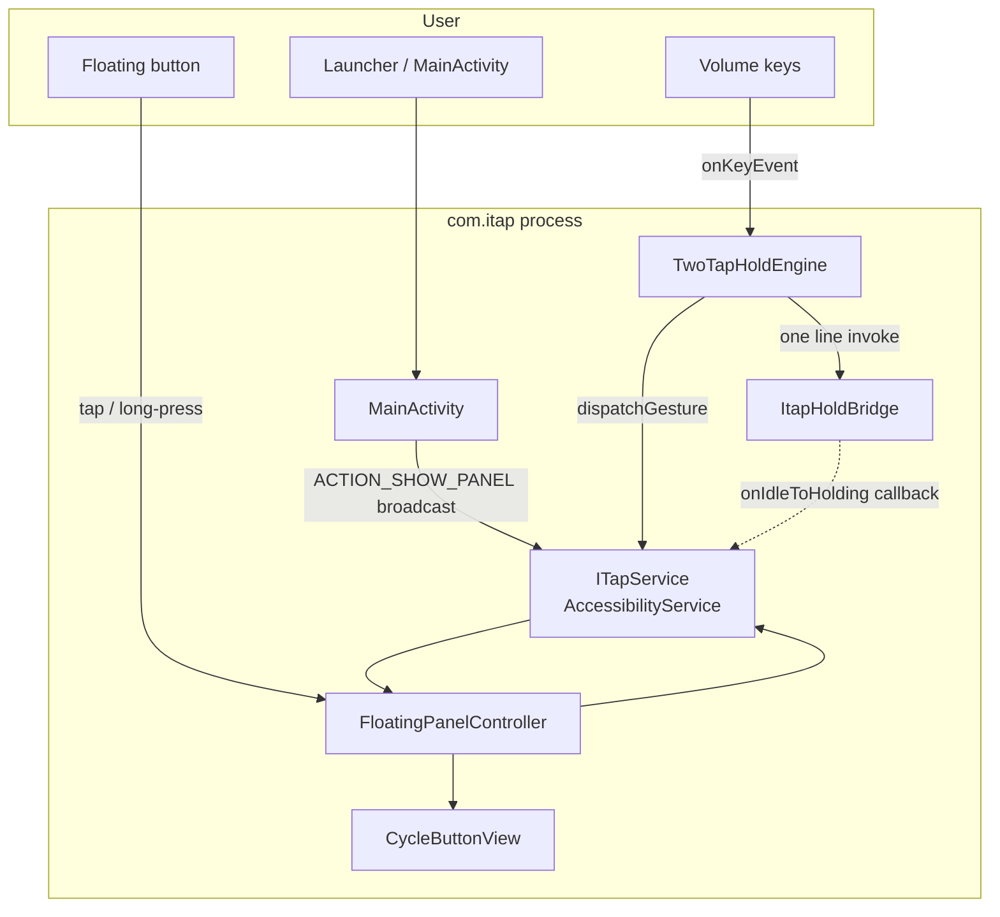

# iTap — Design & Code Map（面向 AI / 维护者）

> 本文描述 **架构边界、数据流、状态机落点、关键文件**。读代码时建议从 `ITapService` 入口向下跟踪。

---

## 1. 高层架构



**原则**：Hold 手势逻辑集中在 `TwoTapHoldEngine`（实现类与文件名见仓库）；`ITapService` 负责 AutoTap、悬浮层、生命周期，并通过 `ItapHoldBridge` 在 **IDLE→HOLDING** 时与 Hold 引擎做一次挂钩（停连点、卸面板）。

---

## 2. 模块职责表

| 组件 | 文件 | 职责 |
|------|------|------|
| 无障碍宿主 | `ITapService.kt` | `AccessibilityService`：注册按键过滤、AutoTap 循环、`dispatchGesture`（连点）、前台保活、`BroadcastReceiver`、`FloatingPanelController` 生命周期 |
| Hold 引擎 | `TwoTapHoldEngine.kt` | 音量组合检测、三态 `IDLE/HOLDING/RELEASING`、阶段 1/2、`continueRightHold`、`forceLift`、`onBrokenContinueChain`；内部 `Handler`；进入 Hold 前通过 `ItapHoldBridge.onIdleToHolding?.invoke()` 回调宿主（`IDLE→HOLDING`） |
| 挂钩对象 | `ItapHoldBridge.kt` | `var onIdleToHolding: (() -> Unit)?`，由 `ITapService` 在 `onServiceConnected` 赋值，在 `onDestroy`/`onInterrupt` 置 `null` |
| 悬浮面板 | `FloatingPanelController.kt` | `TYPE_ACCESSIBILITY_OVERLAY`、`WindowManager.addView/removeView`；`hidePanel`/`showPanel`（Hold 路径里可能配合 detach） |
| 按钮 UI | `CycleButtonView.kt` | 自定义 `View`：同心圆状态、长按隐藏回调 |
| 启动引导 | `MainActivity.kt` | 检查无障碍是否启用；已启用则请求通知权限、一次性电池优化引导、发 `ACTION_SHOW_PANEL` |
| 无障碍元数据 | `res/xml/accessibility_service_config.xml` | `canPerformGestures`、`canRequestFilterKeyEvents`、`flagRequestFilterKeyEvents` |
| 构建脚本 | `scripts/release-apk-and-clean.sh` | `assembleRelease` → 复制 APK 到 `dist/` → `gradle clean` |

---

## 3. `ITapService` 逻辑拆分

### 3.1 生命周期

| 阶段 | 行为 |
|------|------|
| `onServiceConnected` | `FLAG_REQUEST_FILTER_KEY_EVENTS`；设置 `ItapHoldBridge.onIdleToHolding`；`ensureShowPanelReceiver()`；`attachPanelIfAllowed()`；`startAccessibilityKeepaliveForeground()` |
| `onInterrupt` / `onDestroy` | `stopAccessibilityKeepaliveForeground()`；清空 bridge；`detach` 面板；停 AutoTap；反注册广播 |

### 3.2 AutoTap（连点）

- **入口**：`onStartAutoClick()` / `onStopAutoClick()`（由 `FloatingPanelController` 调用）。
- **坐标**：`autoClickCx/Cy` 由屏宽/高与 `density` 推导（略偏左上相对固定比例）。
- **循环**：`handler` + `Runnable runAutoClickStep`；`dispatchTap` 使用 `GestureDescription` 短 stroke；`onCompleted`/`onCancelled` 均推进 `done()`。
- **节流**：`clickGestureReady`；与 Hold 互斥：`canAcceptButtonTap() = clickGestureReady && holdEngine.isHoldIdle()`。
- **彻底停止**：`stopAutoTapFully()` — 清除 `autoRunning`、`removeCallbacks`、立即 `clickGestureReady = true`（进入 Hold 前调用）。

### 3.3 Hold 与音量键

- **委托**：`override fun onKeyEvent` → **整包**交给 `holdEngine.onKeyEvent(event)`。
- **进入 Hold 前的 iTap 行为**：仅在引擎内 `State.IDLE` 且非「仅补抬」分支、即将 `HOLDING` 时，`ItapHoldBridge.onIdleToHolding` 执行：`stopAutoTapFully()` + `floatingPanel?.detach()` + `floatingPanel = null`。

### 3.4 前台保活

- `startForeground` + `NotificationChannel`（低重要性）；Android 14+：`FOREGROUND_SERVICE_TYPE_SPECIAL_USE`（Manifest 已声明 `foregroundServiceType` 与 `PROPERTY_SPECIAL_USE_FGS_SUBTYPE`）。
- 不能替代用户手动保持「无障碍开关」为开。

### 3.5 广播

- `ACTION_SHOW_PANEL`：`attachPanelIfAllowed()`，用于 MainActivity 点图标后恢复悬浮钮。

---

## 4. `TwoTapHoldEngine` 状态机（摘要）

**枚举**：`State { IDLE, HOLDING, RELEASING }`

**音量组合**：

- 记录 `volumeUpTime` / `volumeDownTime`；仅 `ACTION_DOWN`；非音量键返回 `false`。
- 两键时间戳均在 `COMBO_WINDOW_MS`（1200ms）内才视为一次「双键」；然后清零时间戳。
- `gestureReady`：释放后的短冷却，冷却内返回 `true` 消费事件并打日志。

**分支**：

1. **IDLE + `consumeNextIdleComboAsLiftOnly`**：`handler.post { forceLiftRightFinger(..., clearConsumeAfterSuccess = true) }`
2. **IDLE 正常开始**：`ItapHoldBridge.onIdleToHolding?.invoke()` → `state = HOLDING` → `post { startPhase1() }`
3. **HOLDING**：双键 → `RELEASING`（由 `continueRightHold` 下一段抬起）
4. **RELEASING**：双键忽略（日志）

**手势链**（需 API O 续接）：

- `startPhase1`：单 stroke 右指 `PHASE1_MS`
- `startPhase2DualFingerStartChain`：左抬右 `willContinue=true`；`onCompleted` 后 `handler.post { continueRightHold() }`
- `continueRightHold`：`continueStroke`；`isReleasing` 时用短 `LIFT_MS`；取消非释放段 → `onBrokenContinueChain()`

修改 Hold 核心路径时，建议通读本类与 `ITapService` 的挂钩，避免破坏状态机与手势链的时序。

---

## 5. `FloatingPanelController`

- **WindowManager**：`service.getSystemService(WINDOW_SERVICE)`（**不要**用 `applicationContext` 取 WM，避免 `TYPE_ACCESSIBILITY_OVERLAY` token 问题）。
- **类型**：`TYPE_ACCESSIBILITY_OVERLAY`。
- **布局**：`Gravity.TOP | CENTER_HORIZONTAL`，`x`/`y` 为 dp 换算像素；容器 `LinearLayout` + `CycleButtonView`。
- **生命周期**：`attach` / `detach` / `hidePanel` / `showPanel`；`viewsCreated` / `inWindowManager` 防止重复 `addView`。
- **交互**：短按切换 AutoTap；长按调用 `requestExitFromLongPress()`。

---

## 6. `MainActivity`

- 无障碍未开：Toast → `Settings.ACTION_ACCESSIBILITY_SETTINGS`。
- 已开：`POST_NOTIFICATIONS`（API 33+）、**一次性** `REQUEST_IGNORE_BATTERY_OPTIMIZATIONS` 尝试、`sendBroadcast(ACTION_SHOW_PANEL)`、Toast（文案 `strings.xml`）。
- `noHistory` + `excludeFromRecents`：点图标即「闪一下」完成引导。

---

## 7. Manifest 与权限（要点）

| 权限 / 声明 | 用途 |
|-------------|------|
| `BIND_ACCESSIBILITY_SERVICE` | 系统绑定无障碍服务 |
| `FOREGROUND_SERVICE` + `FOREGROUND_SERVICE_SPECIAL_USE` | 前台保活类型 |
| `POST_NOTIFICATIONS` | 通知渠道（API 33+） |
| `REQUEST_IGNORE_BATTERY_OPTIMIZATIONS` | 引导白名单电池优化 |

**未使用**：`SYSTEM_ALERT_WINDOW`（刻意不声明，配合 `TYPE_ACCESSIBILITY_OVERLAY`）。

---

## 8. 构建产物路径

- Gradle 默认：`app/build/outputs/apk/release/iTap.apk`
- 脚本复制后：`dist/iTap.apk`（**dist** = *distribution*）
- `gradle clean` 会删除 `app/build/`，因此 CI / 日常以 `dist/` 或 CI artifact 为准。

---

## 9. OEM / 排错提示（给 AI 的关键词）

- **ColorOS / Oplus**：`continueStroke` 被取消、`GestureResultCallback.onCancelled` — 与 overlay 类型、权限声明、杀进程策略相关；本项目已避免 `SYSTEM_ALERT_WINDOW` + 使用无障碍 overlay。
- **状态「仅补抬」**：补抬路径若在 `onCancelled` 等分支未清 `consumeNextIdleComboAsLiftOnly`，可能出现与 OEM 行为相关的边界问题；若调整，应在理解全状态机后再改，并做真机回归。

---

## 10. 源码文件索引（`app/src/main/java/com/itap/`）

```
ITapService.kt              # 无障碍宿主、AutoTap、广播、前台保活
TwoTapHoldEngine.kt         # Hold 状态机与手势链
ItapHoldBridge.kt           # IDLE→HOLDING 单行挂钩
FloatingPanelController.kt  # 悬浮窗 WM
CycleButtonView.kt          # 按钮绘制与触摸
MainActivity.kt             # 启动引导
```

---

## 11. 给 AI 的推荐阅读顺序

1. `design.md`（本文）→ `ITapService.kt`（`onServiceConnected`、`onKeyEvent`、AutoTap 段）
2. `TwoTapHoldEngine.kt`（`onKeyEvent`、`startPhase1`、`continueRightHold`）
3. `FloatingPanelController.kt` + `CycleButtonView.kt`
4. `AndroidManifest.xml` + `accessibility_service_config.xml`
